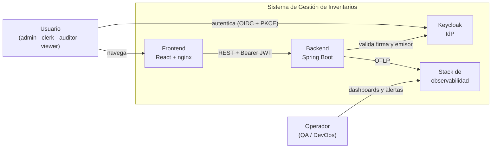

# Documentación de Arquitectura

Cubre la parte de *"Documentación Técnica: incluir diagramas de arquitectura, guías de instalación…"* del enunciado. Los manuales de mantenimiento viven aparte, en [`docs/operacion/`](../operacion/).

| Documento | Contenido |
|---|---|
| [vista-de-componentes.md](vista-de-componentes.md) | Los 14 servicios, cómo se conectan, puertos, volúmenes, orden de arranque y los tres flujos que importan |
| [backend-y-frontend.md](backend-y-frontend.md) | Estructura interna de ambas aplicaciones y las decisiones que la explican |
| [guia-de-instalacion.md](guia-de-instalacion.md) | Levantar el sistema desde cero, verificarlo y qué hacer cuando no arranca |

Los requisitos que esta arquitectura debe satisfacer están en [`docs/requisitos/`](../requisitos/).

---

## Vista de contexto

El sistema no gestiona credenciales: las delega enteras en Keycloak. El backend nunca ve una contraseña, solo tokens que valida contra el JWKS del realm.

---

## Decisiones estructurales

Las cinco que explican por qué el sistema tiene la forma que tiene. Las que además necesitan un ADR formal están anotadas.

### 1. Un único stack en Docker Compose, sin orquestador

El enunciado admite Docker Compose y el proyecto se evalúa levantándolo en clase. Kubernetes añadiría una capa que nadie va a operar. La contrapartida está asumida: no hay alta disponibilidad ni escalado horizontal, y **una sola instancia del backend**.

### 2. Autorización por scope, con el techo en el backend

Keycloak emite los tokens, pero **no es la autoridad efectiva de permisos**: la tabla `SCOPES_BY_ROLE` de `SecurityConfig` descarta cualquier scope que el rol del usuario no permita.

No es una decisión de diseño elegante, es una defensa. El escaneo exploratorio G-6 demostró que el realm entrega **cualquier scope a cualquier usuario autenticado** ([informe](../testing/reportes/G-6-escalada-de-scopes.md)). Corregirlo en la raíz es **G-8**; documentar la decisión es **ADR-002**. Detalle en [RNF-02](../requisitos/requisitos-no-funcionales.md#rnf-02--autorización-por-permiso-no-por-rol).

### 3. Backend sin estado

Sesión `STATELESS`, CSRF deshabilitado, todo el contexto viaja en el JWT. Simplifica el despliegue y hace que el backend sea reiniciable sin que nadie pierda la sesión. Habilita el escalado horizontal que la decisión 1 no aprovecha.

### 4. El esquema solo cambia por migración

Flyway con `validate-on-migrate` e Hibernate con `ddl-auto: validate`. La aplicación **se niega a arrancar** si el esquema no coincide con lo que espera, en vez de parchearlo por su cuenta. Siete migraciones, `V1` … `V7`.

### 5. Organización por dominio, no por capa técnica

Tanto el backend (`product/`, `stock/`, `audit/`, `report/`, `security/`, `common/`) como el frontend (`pages/products`, `pages/stock`…) se agrupan por área funcional. Un cambio en productos toca un directorio, no seis.

---

## Deuda estructural conocida

Lo que un diagrama bonito escondería. Está aquí para que la revisión no tenga que descubrirlo.

| # | Qué | Impacto |
|---|---|---|
| ~~**INF-1**~~ | ~~Redis desplegado, configurado y sin uso~~ — **resuelto**: retirado del compose, el POM y la configuración. El sistema no lo necesitaba. Aplicó la regla 3: *"si algo no se ejecuta, o se conecta o se borra"* | — |
| **A-1** | Dos prefijos de ruta conviviendo: `/products` y `/categories` sin `/api`, frente a `/api/stock`, `/api/reports` y `/api/audit` | Inconsistencia visible en el contrato público. Unificar cerca de la entrega se descartó por riesgo; el README declara las rutas reales en vez de disimularlo |
| **A-2** | `user:manage` no protege ningún endpoint | Un permiso de la matriz obligatoria que se emite y no se aplica |
| **P-2b** | `keycloak-init` no es idempotente | Un `up` repetido falla con `duplicate key … uk_cli_scope`. Afecta al ensayo de la presentación |
| **C-4** | Testcontainers no arranca sobre Docker Desktop en Windows | Las etapas de Jenkins a partir de `Integration Tests` no se pueden validar sin un agente Linux |
