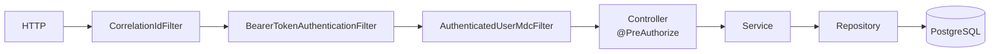

# Backend y Frontend

Estructura interna de las dos aplicaciones que se construyen desde fuente. El resto de servicios son imágenes de terceros, descritos en [vista-de-componentes.md](vista-de-componentes.md).

---

## Backend — Spring Boot sobre Java 21

### Organización por dominio

```
com.inventory
├── product/     Productos y categorías
├── stock/       Movimientos de existencias
├── audit/       Rastro de auditoría (Envers)
├── report/      Reportes y métricas del dashboard
├── security/    Usuarios del dominio
└── common/      Config, excepciones, observabilidad, base de entidades
```

Cada dominio de negocio repite la misma división en capas, y no por ceremonia: separa lo que cambia por reglas de negocio de lo que cambia por infraestructura.

```
product/
├── web/         Controladores REST — @PreAuthorize vive aquí
├── service/     Lógica de negocio
├── repository/  Acceso a datos (Spring Data)
├── domain/      Entidades JPA
├── dto/         Records de request y response
└── mapper/      Entidad ↔ DTO
```

### El flujo de una petición, capa a capa



El orden de los filtros no es casual:

- **`CorrelationIdFilter` envuelve la cadena entera**, así que un `correlationId` y el endpoint quedan en el MDC incluso para las peticiones que terminan en **401** antes de identificar al usuario.
- **`AuthenticatedUserMdcFilter` va después** de validar el token: solo a partir de ahí hay usuario que registrar. Añade el usuario al MDC para los seis campos de log que exige RNF-13.

### Reglas transversales, y por qué

| Decisión | Dónde | Motivo |
|---|---|---|
| Inyección por constructor, campos `final` | todos los servicios | Testeable sin reflexión, dependencias explícitas |
| DTOs como `record` | `*/dto/` | Inmutables; el mapeo entidad↔DTO ocurre en el borde, la entidad no viaja a la web |
| `BigDecimal(15,2)` para el precio | `Product` | El dinero no se representa en coma flotante binaria |
| `open-in-view: false` | `application.yml` | La sesión JPA no se mantiene abierta durante el renderizado; sin esto, consultas perezosas ocultas en la serialización |
| Excepciones de dominio → `ProblemDetail` | `common/exception` | El cliente recibe un error tipado; el detalle interno se registra, no se filtra (`include-message: never`) |
| Auditoría por anotación | `@Audited` en las entidades | Envers versiona sin ensuciar la lógica de negocio |

### Perfiles

Seis, en `application-*.yml`. Difieren en tres ejes: **CORS**, **formato de log** y **muestreo de trazas**.

| Perfil | CORS | Log | Uso |
|---|---|---|---|
| `dev` | abierto a puertos de desarrollo | texto plano | Desarrollo local |
| `demo` | `localhost:3000` | JSON, 6 campos MDC | **Presentación final** |
| `staging` | dominios reales | JSON | Espeja producción; pruebas contra el desplegado |
| `prod` | dominios reales | JSON | Producción |
| `test` | — | — | Suite automatizada |
| `smoke` | — | — | Verificación post-despliegue |

El perfil `demo` existe porque la demo necesita a la vez log JSON —sin él los paneles de Loki no filtran por usuario ni endpoint— y CORS hacia `localhost`, y ningún perfil daba ambas cosas. Se descartó tocar `staging`, que declara espejar producción; `CorsProfilesTest` impide que alguien vuelva a meter `localhost` en `staging` o `prod`. Detalle en el [informe P-2a](../testing/reportes/P-2a-perfil-demo.md).

### Dependencias que marcan la arquitectura

`web`, `data-jpa`, `validation`, `actuator`, `security` + `oauth2-resource-server`, `hibernate-envers`, `flyway-core` + `flyway-database-postgresql`, `springdoc-openapi`. Ni una de más: `data-redis` estaba declarado sin uso y se retiró en INF-1.

---

## Frontend — React + TypeScript, servido por nginx

### Estructura

```
src/
├── pages/         Una carpeta por vista: products, stock, reports, audit
├── components/
│   ├── auth/      PermissionGuard
│   ├── layout/    Marco común de navegación
│   └── ui/        Piezas reutilizables (Badge…)
├── contexts/      AuthContext — sesión y permisos
├── hooks/         useProducts…
├── lib/           api, keycloak, session, csvExport
└── types/         Contratos TypeScript de las respuestas
```

Cinco rutas bajo un `Layout` común ([`App.tsx:26`](../../frontend/src/App.tsx#L26)): dashboard (`/`), `products`, `stock`, `reports`, `audit`. Cualquier ruta desconocida redirige al dashboard.

### Separación de responsabilidades en `lib/`

| Fichero | Responsabilidad |
|---|---|
| `keycloak.ts` | Login OIDC con PKCE contra el realm |
| `session.ts` | Ciclo de vida del token: `onTokenExpired`, `onAuthRefreshError` (RNF-04) |
| `api.ts` | Cliente REST; adjunta el Bearer, centraliza el manejo de error |
| `csvExport.ts` | Exportación de tablas a CSV |

### Autorización en la interfaz: ocultar, no romper

`PermissionGuard` ([`components/auth/`](../../frontend/src/components/auth/PermissionGuard.tsx)) decide, a partir de los scopes del token en `AuthContext`, qué se muestra. Un botón que el usuario no puede usar **no aparece**, en vez de aparecer y devolver un 403 al pulsarlo.

Es comodidad de interfaz, **no seguridad**: la autorización real la impone el backend con `@PreAuthorize` (RNF-02). Ocultar un botón nunca es un control de acceso; que el frontend lo esconda no cambia que el backend lo tiene que denegar igual.

### Deuda conocida

`AuthContext.tsx` arrastra los **dos** defectos de scopes que se corrigieron en el backend (G-4 y G-5): calcula los permisos con lógica de "primer rol gana" en vez de unir los de todos los roles. **G-3a** en el plan (issue #44). Mientras siga, un usuario multi-rol ve en la interfaz menos de lo que el backend le permitiría — falla del lado seguro, pero es un defecto.

### Verificación

Cuatro suites de test unitario: `Badge`, `csvExport`, `PermissionGuard`, `session`. Cobertura de líneas en **7,1 %** — el hueco de calidad conocido y declarado (RNF-17). Los flujos completos se cubren con los tres specs de Playwright en `e2e/`, que **el pipeline todavía no ejecuta** (C-1).
