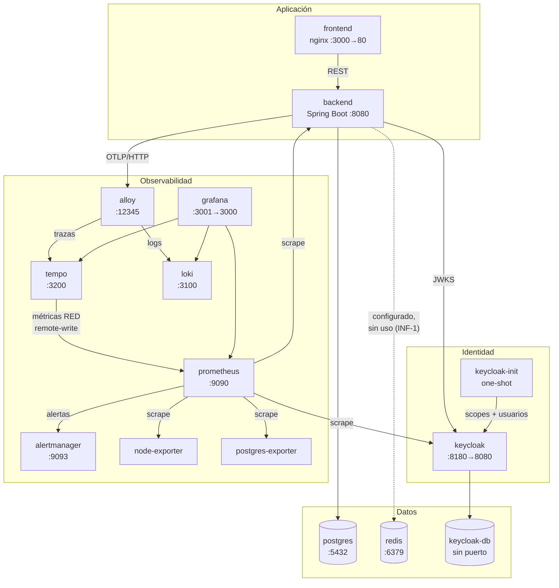
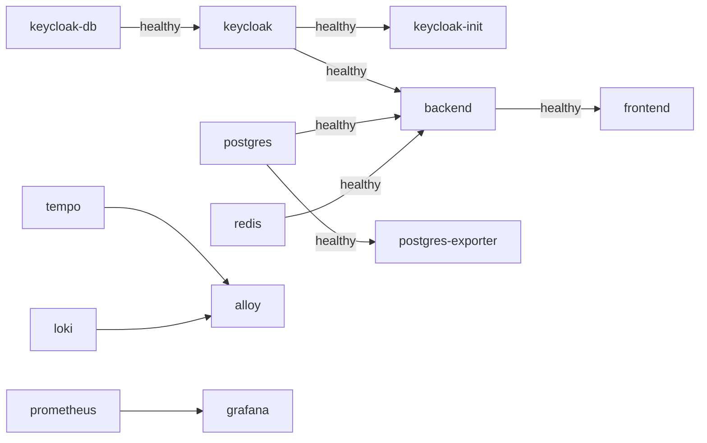
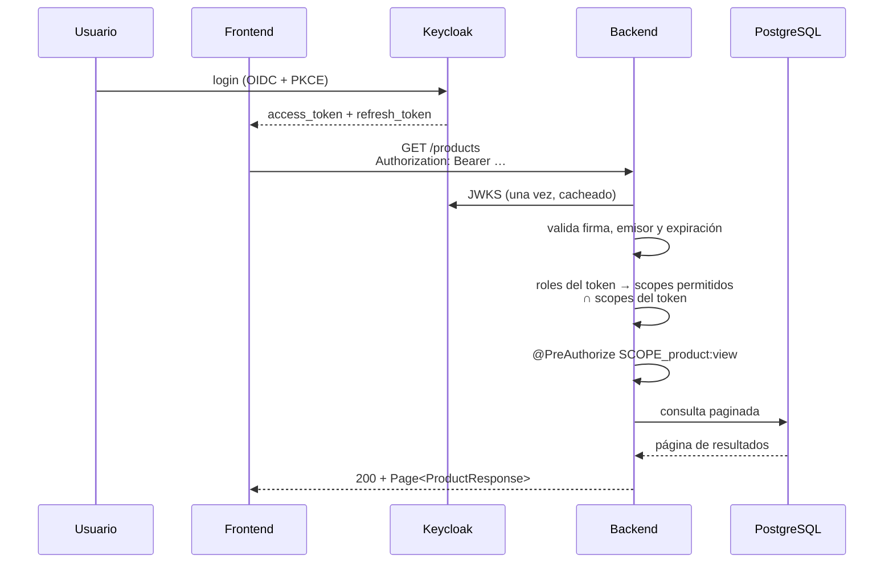
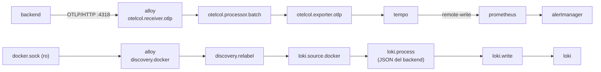
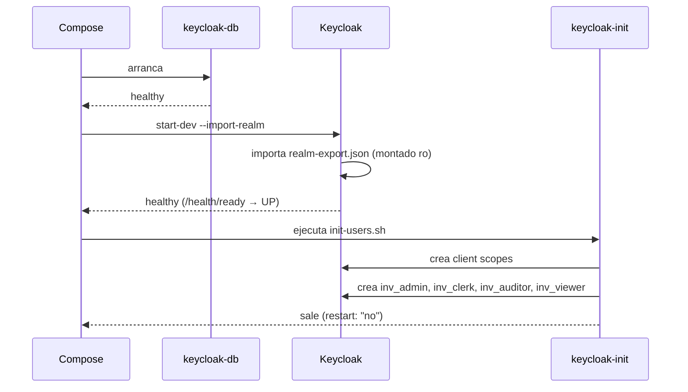

# Vista de Componentes

Los 15 servicios de `docker-compose.yml`, cómo se conectan y en qué orden arrancan. Todos comparten una única red bridge, `inventory-net`.

---

## Diagrama

---

## Inventario de servicios

| Servicio | Imagen | Puerto host | Volumen | Rol |
|---|---|---|---|---|
| `postgres` | `postgres:16-alpine` | 5432 | `postgres_data` | Datos de negocio |
| `redis` | `redis:7-alpine` | 6379 | `redis_data` | Cache — **desplegado sin uso, INF-1** |
| `keycloak-db` | `postgres:16-alpine` | — | `keycloak_db_data` | Datos del IdP |
| `keycloak` | `quay.io/keycloak/keycloak:24.0` | 8180 → 8080 | — (realm montado `ro`) | Identidad y emisión de tokens |
| `keycloak-init` | `alpine:3.19` | — | — | One-shot: crea scopes y los 4 usuarios de prueba |
| `backend` | build `./backend` | 8080 | — | API REST |
| `frontend` | build `./frontend` | 3000 → 80 | — | SPA servida por nginx |
| `node-exporter` | `prom/node-exporter:v1.8.2` | — | — | CPU, memoria, disco y red del host |
| `postgres-exporter` | `prometheuscommunity/postgres-exporter:v0.15.0` | — | — | Conexiones, transacciones, locks |
| `prometheus` | `prom/prometheus:latest` | 9090 | `prometheus_data` | Métricas y evaluación de reglas |
| `tempo` | `grafana/tempo:2.6.1` | 3200 | `tempo_data` | Trazas |
| `loki` | `grafana/loki:3.3.2` | 3100 | `loki_data` | Logs |
| `alloy` | `grafana/alloy:v1.5.1` | 12345 | `alloy_data` | Collector: recibe OTLP y recoge logs de Docker |
| `alertmanager` | `prom/alertmanager:v0.27.0` | 9093 | `alertmanager_data` | Enrutado y agrupación de alertas |
| `grafana` | `grafana/grafana:latest` | 3001 → 3000 | `grafana_data` | Dashboards |

Nueve volúmenes con nombre. `docker compose down -v` los borra **todos**, incluido el del realm de Keycloak: es exactamente lo que hace falta para un arranque limpio y exactamente lo que no hay que hacer sobre datos que interesen.

`prometheus` y `grafana` usan tag `latest` **[criterio propio, discutible]**: reproducible hoy, no necesariamente dentro de seis meses. El resto está fijado a versión.

---

## Orden de arranque

Compose no espera a que un servicio sea *útil*, solo a que exista, salvo que se le pida lo contrario. Aquí se le pide: cinco dependencias usan `condition: service_healthy`.

El backend espera a que Postgres, Redis **y** Keycloak estén sanos. Arrancar antes que Keycloak significaría no poder descargar el JWKS y rechazar todo token durante el arranque.

### Las sondas que costaron encontrar

Tres healthchecks no son la versión evidente, y el `docker-compose.yml` explica por qué en comentarios. Vale la pena repetirlo aquí, porque son trampas que se repiten al tocar el fichero:

**Keycloak — sonda con `/dev/tcp`.** La imagen no trae `curl`, `wget` ni `nc`. La sonda se hace con el redirector de bash y tiene tres detalles que importan:

- `127.0.0.1`, no `localhost`: `/etc/hosts` resuelve `localhost` también a `::1`, bash prueba IPv6 primero y Keycloak solo escucha en IPv4, así que la apertura del socket se colgaba sin timeout propio.
- El `timeout` envuelve el comando entero, no solo la lectura.
- `grep <&3` en vez de `cat | grep`, para cortar en cuanto aparece `UP` sin esperar al cierre.

**Keycloak — `init: true`.** PID 1 es el proceso Java, que no reapea huérfanos. Cada sonda colgada dejaba un bash zombi hasta dejar el contenedor irrecuperable: Docker no podía ni pararlo (*"PID is zombie and can not be killed"*). El init los recoge. Es defensa en profundidad sobre el arreglo anterior.

**node-exporter — montar `/host/root`.** Sin él solo se ven los tmpfs del propio contenedor y el panel de espacio libre del dashboard de Infraestructura sale vacío. No se monta la raíz con `rslave` porque la propagación de montajes compartidos no está disponible en Docker Desktop.

---

## Flujo 1 — petición autenticada

El paso de la intersección es el que impide la escalada de G-6: un scope que el rol no permite se descarta aunque Keycloak lo haya firmado. Sin rol reconocido no se concede nada.

**La separación de URLs de Keycloak importa.** El backend valida el claim `iss` contra la URL **externa** (`http://localhost:8180/…`, la que ve el navegador) y descarga las claves por la URL **interna** (`http://keycloak:8080/…`, que no sale de la red de Docker). Unificarlas rompe la validación en contenedores: o el claim no cuadra, o las claves no se alcanzan.

---

## Flujo 2 — telemetría

Dos caminos distintos que terminan en el mismo Grafana:

- **Trazas.** El backend exporta por OTLP/HTTP a Alloy, que agrupa en lotes y reenvía a Tempo. Muestreo al 100 % — aceptable en un sistema de esta escala, no en producción real.
- **Logs.** Alloy descubre los contenedores por el socket de Docker, montado **solo lectura**, y consume sus salidas. Alloy corre como `root` porque el socket es `root:root` con permisos 660 y su usuario por defecto (uid 473) no podría leerlo.

Tempo hace `remote-write` de las métricas RED derivadas de las trazas hacia Prometheus, que arranca con `--web.enable-remote-write-receiver` para aceptarlas.

Prometheus raspa **5 targets**: él mismo, `inventory-backend`, `node-exporter`, `postgres-exporter` y `keycloak`. El de Keycloak aporta solo métricas de Quarkus —`agroal`, `jvm`, `worker`…—, **ninguna serie de login**: Keycloak 24 no las expone. Los fallos de autenticación se cubren con los 401 del backend y con los eventos `LOGIN_ERROR` que Loki indexa.

---

## Flujo 3 — arranque del realm

La configuración del realm entra por dos vías: **declarativa** (`keycloak/realm-export.json`, montado solo lectura e importado al arrancar) e **imperativa** (`scripts/keycloak/init-users.sh`, que crea scopes y usuarios de prueba).

**`keycloak-init` no es idempotente.** Sobre un realm que ya existe falla con `duplicate key … uk_cli_scope` y ensucia el panel de eventos. En un arranque limpio no se nota; en un `up` repetido, sí. Es **P-2b** (issue #45), y afecta directamente al ensayo de la presentación, que consiste precisamente en repetir `down -v && up`.

---

## Empaquetado de las imágenes

**Backend** — dos etapas sobre `eclipse-temurin:21`, JDK para construir y JRE para ejecutar:

- Las dependencias se descargan en una capa propia (`dependency:go-offline`) antes de copiar el código, así un cambio de fuente no reconstruye el árbol de dependencias.
- El JAR se extrae en capas de Spring Boot (dependencias, loader, snapshots, aplicación), de menos a más volátil.
- Corre como usuario **no root** (`inventory`), con `HEALTHCHECK` propio en `/actuator/health`.

**Frontend** — `node:20-alpine` construye, `nginx:alpine` sirve. Al contenedor final no llega ni Node ni `node_modules`: solo `dist/` y una `nginx.conf` propia.
